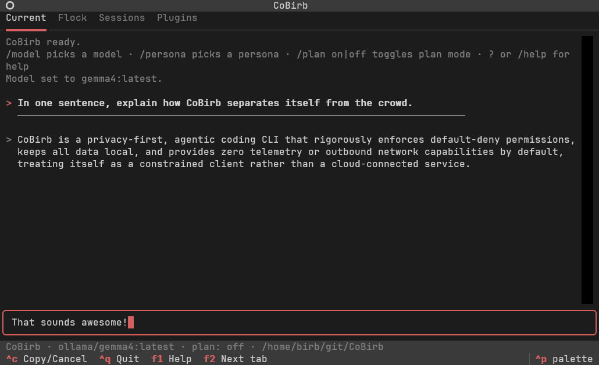

# CoBirb 🦜

[](https://github.com/HeckerBirb/CoBirb/actions/workflows/tests.yml)
[](https://www.python.org/downloads/)
[](./LICENSE)


A privacy-first, agentic coding CLI for local LLMs and your eyes only.



> **Privacy-first by design.**

- 🔒 No telemetry. No analytics. No pings. No little birbs singing (except for you).
- 🔒 No outbound network by default. Models are yours to configure.
- 🔒 Sessions are encrypted at rest (AES-256-GCM, keyed via scrypt).
- 🔒 Credentials are stripped from tool output before the model, the session or the
  audit log ever see them - private keys, `AKIA…`, `ghp_…`, `sk-…` and friends.
- 🔒 No tool permission is pre-approved by default - but can be for convenience and control.
- 🔒 Your model's own `SYSTEM` prompt is left alone, broken or not.
- 🔒 Encrypted coding sessions on demand (sessions disabled by default).
- 🦜 "Flock" mode lets you use one model to distribute isolated workloads to worker agents; "broken" Brainy Birbs tell expert Worker Birbs what to do on need-to-know basis.
- 🦜 Optional personas - various twists on the replies. Off by default.

## Quick start

Starting from nothing, on a machine with [Ollama](https://ollama.com) installed:

```bash
ollama pull qwen2.5-coder:14b     # or any other model you want to use, CoBirb doesn't judge

git clone https://github.com/HeckerBirb/CoBirb && cd CoBirb

pipx install --editable .         # adds a `cobirb` binary to PATH

# Interactive: the full-screen app.
cobirb
```

Everything else:

```bash
# One-shot with specific model
COBIRB_MODEL_NAME="ornith-1.5:9b" cobirb -p "list the files in this directory" --allow-tool=list_dir

# One-shot with default model(s)
cobirb -p "check if the pytests pass" --headless --output json \
  --allow-tool='shell(python -m pytest)'

# Encrypted session enabled and password protected
cobirb -w hunter2
cobirb -w
cobirb --session ~/.cobirb/sessions/session-20260912-185817.json -w

# Upgrade CoBirb to the latest version
cobirb --upgrade

# Read more in the help text
cobirb --help
```

Looking for a config to start from instead of an empty one? See [examples/](./examples/).

## Alternative installation method

The Quick start above uses [pipx](https://pipx.pypa.io): `pipx install --editable .`, run once
from the clone, puts a `cobirb` binary on your `PATH` with its three dependencies isolated in
their own environment — no venv to remember to activate. `--editable` keeps it pointed at the
clone, so a plain source change (yours, or `git pull`) needs nothing further.

Prefer a plain venv instead if you're going to be editing CoBirb's own source:

```bash
python3 -m venv .venv && source .venv/bin/activate
pip install -e .      # or ".[dev]" for the test suite
```

Either way, only a **source change** is picked up automatically. A `pyproject.toml` change (a
new dependency, a changed entry point, a version bump) needs `pip install -e .` — or `pipx
install --editable .` again, over the same install — rerun: that's metadata pip snapshots once
at install time, not something it reads fresh off the source on every run. It's cheap and
idempotent, so re-running it after a `git pull` when you're unsure never hurts.

**Staying current:** `cobirb --upgrade` moves this checkout to the latest tagged release —
fetches, checks out the tag, and reinstalls, in one step. Name a specific release instead with
`cobirb --upgrade v0.8.0`. It refuses to move to an *older* release than the one currently
running unless you pass `--force`, and refuses outright on a checkout with uncommitted changes
rather than guessing what to do with them. This is the one CoBirb command that talks to a
network by default — allowed because you just typed it, the same reasoning `cobirb plugin
install` already relies on to run a plugin's own code.

## Configuration

Copy [`config.json.example`](./config.json.example) to `~/.cobirb/config.json` and edit it. See
`cobirb help config` for what each key does.

This is enough to get started with Ollama (localhost:11434), default `SYSTEM` prompts 
(no personas) and separate Flock-mode models:

```json
{
  "models": {
    "default": {
      "name": "gemma4:latest",
      "base_url": "http://localhost:11434"
    },
    "orchestrator": {
      "name": "gemma4-free-as-in-liberty:latest"
    },
    "worker": {
      "name": "ornith-1.5:9b"
    }
  },

  "persona": "none",
  "system_prompt": "off",
  "plugins": {
    "model": "core-model",
    "io": "core-io",
    "crypto": "core-crypto"
  }
}
```

## Disclaimer: what CoBirb does not protect you from

Being straight about the edges, since the rest of this page makes strong claims:

- **Your model server is a separate program you didn't write.** CoBirb's guarantees end at
  the socket. Ollama binds an *unauthenticated* local port — any process running as you can
  read what you send it or issue its own requests — fetches weights from a registry, and
  makes outbound requests on its own schedule. None of that is malicious; all of it is trust
  rather than enforcement. `llama-server`, LM Studio and vLLM have the same shape. **CoBirb will
  not close this itself** — it is a client of an OpenAI-compatible endpoint and deliberately does
  not run models (an embedded GGUF runtime was considered and dropped; see §17 of
  [`AGENTS.md`](./AGENTS.md)). Where inference happens is yours to choose, including an endpoint
  you wrote. If the endpoint's trustworthiness matters to you, that is a property to fix in the
  endpoint, and it is fixable — `llama-server` will bind a Unix socket instead of a port
  (`--host /path/to.sock`), which removes the port any local process can reach.
- **An approved shell command runs with your full user privileges.** CoBirb decides
  *whether* a command runs, not what it can reach once it does. Approve `npm test` and
  that command can read `~/.ssh` and open a socket like any other program you'd run.
  There is no sandbox. Approve narrowly, and prefer `shell(git status)`-style rules over
  trusting a bare binary.
- **`/undo` does not cover what a shell command did.** CoBirb copies a file aside before
  `write_file`, `edit_file` or `apply_patch` changes it, so `/undo` puts those back. A
  shell command cannot say in advance what it will touch, so anything it does is outside
  that. Keep your work in git as well.
- **Context is finite.** Long sessions are compacted to fit the model's window (see
  `/context`); old tool results are summarised away first, and a large file is read a
  range at a time rather than whole. Nothing is lost from your session file, only from
  what the model is shown at once.
- **Installing a plugin runs that plugin's code.** `cobirb plugin install` hands the directory to
  `pip`, and pip executes the package's own build backend — so the install is arbitrary code
  execution at your privileges, before CoBirb has looked at a single class and before any
  permission prompt exists to ask you about it. No prompt can cover this; it is what installing any
  Python package means. A plugin is code you chose to run, and choosing it *is* the security
  decision. Afterwards its tools are gated like any others; the install itself is not.
- **An MCP server you configure is a program you chose to run.** CoBirb's "no telemetry, no
  outbound network" promises are about CoBirb. A configured server can open its own network
  connections and send the arguments of every call it receives — file paths, code, queries —
  anywhere it likes, and nothing in CoBirb detects or prevents that. Two defaults reduce the
  blast radius: a server does **not** inherit your environment (no cloud credentials, no API
  tokens for unrelated services), and its tools are pre-approved by nothing. Read
  `cobirb help mcp` before adding one; it also has a worked example of writing your own
  offline server, which is the case worth building for.

## Documentation

- [docs/](./docs/) — short how-to pages: [install](./docs/manual/install.md),
  [first run](./docs/manual/first-run.md), [commands](./docs/manual/commands.md),
  [CLI](./docs/manual/cli.md), [config](./docs/manual/config.md),
  [permissions](./docs/manual/permissions.md), [sessions](./docs/manual/sessions.md),
  [memory](./docs/manual/memory.md), [images](./docs/manual/images.md),
  [the Flock](./docs/manual/flock.md), [plugins & MCP](./docs/manual/plugins-and-mcp.md).
- [AGENTS.md](./AGENTS.md) — the single source of truth: architecture, the plugin SPI,
  the security design, and the working conventions.
- [examples/](./examples/) — configurations to start from, each focused on one combination
  of settings.
- [CHANGELOG.md](./CHANGELOG.md) — release history.

## License

MIT — see [LICENSE](./LICENSE).
